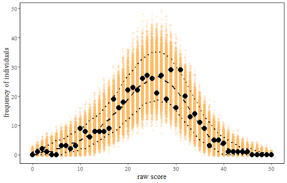
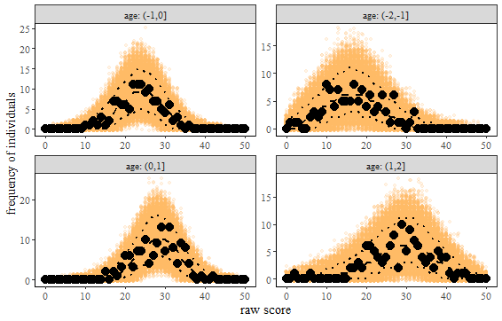
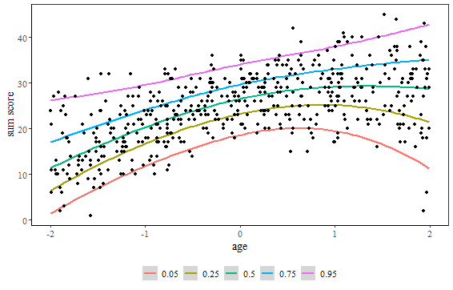

```{r setup, include = FALSE}
knitr::opts_chunk$set(
  collapse = TRUE,
  comment = "#>"
)
```


# Introduction

Norm-referenced psychological tests evaluate an individual’s performance relative to a reference population, typically using standardized scores such as T-, IQ- or z-scores @AERA2014. Many developmental and intelligence tests rely on reference populations that change continuously with age.

In such settings, item response theory (IRT)-based continuous norming models are useful for deriving age-specific norm information. 
These models explicitly allow the latent trait distribution to depend on age. As a result, each individual’s latent trait estimate can be directly compared to the age-specific reference population using a z-standardized norm score @heister2024item.
As in most parametric IRT models, the latent trait distribution is assumed to be normally distributed in the reference population. Further, the latent trait distribution of psychological tests can typically be assumed to change smoothly with age. Therefore, the age-related changes can be captured by modeling the distribution's mean and standard deviation as a smooth function of age, using polynomial regression or penalized splines.

Simulation studies have demonstrated that IRT-based continuous norming models can accurately recover age-specific norms, and empirical evaluation of IDS-2 @grob2018idsNL has shown that these models can fit empirical data well @heister2024item.
Compared to raw score–based continuous norming methods, which is the default approach in many applications, IRT-based models offer several advantages. These include the use of all available item-level information, the ability to model multiple latent traits and their relationships, and the straightforward integration of adaptive testing procedures.

`IRTnorm` is based on a framework for deriving age-specific norm scores using Bayesian IRT-based continuous norming models. It includes tools for model comparison, model estimation, visual inspection of model fit, and extraction of norm scores.

This vignette introduces the main modeling concepts of `IRTnorm` and demonstrates its use on example data.

# Workflow overview
  
The main workflow in `IRTnorm` consists of:

1. Perform model selection (`compare_IRTnorm_models`,`compare_polynomial_degrees`, `visual_polynomial_degrees`);
2. Fit the selected model and extract all important model information (`estimate_norming_model`);
3. Evaluate model fit (`NC`, `NC_visual`, `normscore_dist`, `quantile_curves`, `item_person_fit`, `effect_age`) ;
4. Norm new individuals (`norm_new_individual`).

---
  
# Norming a unidimensional test
We illustrate the modeling process using a small simulated data set(response_data), to keep the example concise. In practical applications, larger data sets may be required.

The following code loads the required package and the example data.
```{r loadlibrary, echo=TRUE, include=TRUE, warning=FALSE, message = FALSE}
library(IRTnorm)
data("response_data")
```

## 1. Perform model selection
Selecting an appropriate IRT-based norming model for a normative dataset requires considering a set of plausible models.
The models in this set can differ in both the specific IRT model choice, and/or the model specifications for the age effects. 

When selecting candidate IRT models, a pre-selection should be made based on the characteristics of the test.
For example, if the test contains binary items and guessing might influence responses,
a 3PL-norm model may be evaluated alongside the 2PL-norm model. If guessing is unlikely, 
only 1PL- and 2PL-norm models need to be considered.

To compare the fit of the plausible IRT models, the function `compare_IRTnorm_models()` 
can be used. This function fits the set of plausible models specified and returns their
expected log predictive density (ELPD) differences for comparison,
relying heavily on the `loo` package, see @loo2026.

The IRT models to compare are specified using the `model_specifications` argument.
This argument expects a list in which each element holds the model information for one 
norming model. Each element itself is a list containing at minimum  the `irt_model` argument, 
which specifies the IRT model to be fitted, and the `age_model` argument, which specifies whether age effects are modeled using splines or polynomial regression. Additional configuration options are available depending on the value of the argument `age_model`. See the function documentation for a complete description of the available options.

To ensure a fair comparison, we recommend using the same polynomial degrees across all models and choosing degrees that are sufficiently high to capture the underlying trajectory. In this example, we use a fourth-degree polynomial for the mean and a third-degree polynomial for the standard deviation. This function uses 500 warm-up and 500 sampling iterations by default to keep the computational cost minimal. However, increasing the number of iterations can be useful for complex model comparison or to increase precision. For this illustration we use the default number of iterations.
Finally, the norming data must be supplied via the data argument as either a `data.frame` or a `matrix` containing the individuals' ages and item responses. The age variable (`age_variable`) and the item response variables (`item_variables`) can be specified either by their variable names or by their column positions.

```{r fit_IRTmod, echo=TRUE, include=TRUE, eval = FALSE}
 model_list <- list( A = list(irt_model = "1PLnorm", age_model = "poly",        
                                        poly_mean = 4, poly_sd = 3),
                     B = list(irt_model = "2PLnorm", age_model = "poly",
                                        poly_mean = 4, poly_sd = 3))

compare_IRTnorm_models(model_specifications = model_list, 
                                              raw_data = response_data, 
                                              age_variable = "age", 
                                              item_variables = 1:50)
``` 

```{r load_modelcomparee,  echo=FALSE, include= TRUE, eval = TRUE}
data("different_IRTmodels")
different_IRTmodels
```

We recommend selecting the more complex IRT model only if the ratio ELPD_diff / SE is less than -1.96 for the comparison with the less complex model. In this example, this criterion is met, and we therefore select the 2PL norming model for the remainder of the analysis.

Once the IRT model has been selected, the next step is to determine the most appropriate specification for the age effect. The function `compare_age_models()` compares models based on their expected log predictive density (ELPD), either over a user-specified grid of polynomial degrees or by using forward selection. We recommend evaluating a grid of polynomial degrees, as this provides additional insight into the behavior of the age effects. It is often also informative to compare polynomial regression with penalized splines, which can be done by setting `include_splines = TRUE`.

```{r fit_poly, echo=TRUE, include=TRUE, eval = FALSE}
my_grid <- expand.grid(mu = 1:4, sd = 0:3)
different_poly_2PL <- compare_age_models(method = "grid", 
                                         grid = my_grid, 
                                         irt_model = "2PLnorm",
                                         raw_data = response_data, 
                                         age_variable = "age", 
                                         item_variables = 1:50, 
                                         include_splines = FALSE)

``` 

```{r load_modelcompare,  echo=FALSE, include= TRUE}
data("different_poly_2PL")
``` 

Because differences in model complexity across polynomial degrees are typically small, we recommend selecting the specification with the highest ELPD, provided that the resulting trajectory is plausible. To inspect the ELPD differences visually, use the `visual_polynomial_selection()` function with `perspective = "ELPD"`.

```{r load_modelcompare2,  echo=TRUE, include= TRUE, eval = TRUE,fig.width=6,fig.height=4, fig.align = "center"}
visual_polynomial_selection(different_poly_2PL, perspective = "ELPD", highlight_ranks = 3)
```

The model with the highest ELPD, highlighted in red, uses second-degree polynomials for both the mean and the standard deviation. The plot further indicates that a second-degree polynomial is required for the standard deviation, as all models with lower-degree polynomials yield considerably lower ELPD values. For the mean, a first-degree polynomial is insufficient, as models using higher-degree polynomials achieve higher ELPD values when the standard deviation is modeled with a sufficiently flexible polynomial.

To inspect the fitted trajectories, set `perspective = "trajectory"` in `visual_polynomial_selection()`. The number of highlighted top-performing models can be controlled using the `highlight_ranks` argument.

```{r load_modelcompare3,  echo=TRUE, include= TRUE, eval = TRUE,fig.width=6,fig.height=4, fig.align = "center"}
 visual_polynomial_selection(different_poly_2PL, perspective = "trajectory", highlight_ranks = 3)
```

These results support selecting the 2PL model with second-degree polynomials for both the latent trait mean and the latent trait standard deviation as the final norming model. We therefore use this model for the remainder of the norming procedure. The fitted trajectories are also reassuring, as all models with polynomial degrees that are sufficiently high to capture the underlying trend, produce very similar trajectories.

## 2. Fit the selected model and extract all important model information 

Once the norming model has been selected, it should be refitted using a sufficient number of iterations to obtain the final parameter estimates. The resulting model can then be used to extract all information required for norming. This is accomplished with the `estimate_norming_model()` function.


```{r data_prep2, echo=TRUE, include=TRUE, eval = FALSE}
info <- estimate_norming_model(raw_data = response_data, 
                       age_variable = "age", 
                       item_variables = 1:50,
                       irt_model  = "2PLnorm", 
                       age_model = "poly", 
                       poly_mean = 2, 
                       poly_sd = 2, 
                       seed = 1234,
                       iter_warmup = 2000,
                       iter_sampling =2000, 
                       extract_stan_object = TRUE)

```

```{r load_info,  echo=FALSE, include= TRUE}
data("info")
``` 

After fitting the IRT norming model, its convergence and overall fit should be evaluated to assess whether the resulting estimates are trustworthy. The `IRTnorm` package provides several functions for assessing and visualizing model fit from different perspectives.

The first step in evaluating a Bayesian IRT norming model is to verify that the MCMC algorithm has converged, as reliable inference depends on convergence. Two key diagnostics are the potential scale reduction factor (R-hat) and the effective sample size (ESS). Values of R-hat should be close to 1, indicating convergence across chains, while larger ESS values indicate more precise and reliable parameter estimates.

```{r showfit02, echo=TRUE, include=TRUE,eval = TRUE}
info$conv_info 
``` 

In this example, the R-hat values are below 1.01 for all parameter groups, and the effective sample size exceeds 400 for nearly all parameters, indicating good convergence. In addition, the tail and bulk effective sample sizes (`ess_tail` and `ess_bulk`) are similar, providing further evidence of satisfactory MCMC performance. A substantial difference between these quantities may indicate sampling problems, in which case the model should be investigated further. Possible remedies include increasing `adapt_delta` or increasing the number of warm-up and sampling iterations via the `iter_warmup` and `iter_sampling` arguments when fitting the model.

In addition to these numerical diagnostics, convergence should be assessed visually for key parameters, such as the regression coefficient for the latent trait mean (`p1_theta`):
```{r showfit03, echo=TRUE, include=TRUE ,eval = FALSE}
library(bayesplot)
conv_plot <- bayesplot::mcmc_trace(info$model_stan_obj$draws(c("p1_theta")))
``` 

```{r showfit03_show, echo=TRUE, include=TRUE, fig.width=6,fig.height=4, fig.align = "center" ,eval = FALSE}
data("conv_plot")
conv_plot
```

In this example, the chains have mixed well, as evidenced by the substantial overlap between chains and their free movement throughout the same region of the parameter space. There are no visible trends, drifts, or abrupt jumps, suggesting that the sampler has converged.

If the trace plots exhibit systematic patterns, if the R-hat values are high, or if the effective sample sizes are low, the model may require additional sampling. A good first step is to increase the number of warm-up iterations before considering other adjustments.

## 3. Evaluate model fit 

Once convergence has been established, the next step is to evaluate how well the model fits the observed data. A useful diagnostic is to compare the observed raw score distribution with the posterior predictive (model-implied) raw score distributions generated from the fitted model. This comparison can be obtained using the `NC()` function and visualized with `NC_visual()`.

The evaluation can be performed for the entire sample or separately for different age groups. We begin by assessing model fit for the complete sample.

```{r NC1, echo=TRUE, include=TRUE ,eval = FALSE}
NC_info <- NC(fit_info = info)
NC_visual(NC_info = NC_info)
``` 

```{r NC2,  echo=FALSE, include= TRUE, fig.width=6,fig.height=4, fig.align = "center"}

``` 

The observed raw score distribution appears to be well represented by the fitted model. Most observed raw scores (black dots) lie within the 90% posterior predictive interval (dotted lines), and all observed values fall within the range of the posterior predictive distribution (indicated by the orange points). Together, these results suggest that the fitted model reproduces the observed raw score distribution well.

To assess model fit across the full age range of the target population, the same evaluation should also be performed separately for different age groups. This can be accomplished using the `NC()` and `NC_visual()` functions with the `age_range` argument. The NC statistics are then computed and visualized separately for the specified age groups.

```{r ageMC, echo=TRUE, include=TRUE ,eval = FALSE}
NC_info_age <- NC(fit_info = info, 
                      age_range = seq(-2,2,1))
``` 

```{r showfit2_NC, echo=FALSE, include=TRUE, fig.width=6,fig.height=4, fig.align = "center"}


``` 

The model appears to provide a good fit across all age groups, as the observed raw score distributions are consistent with those implied by the fitted model.

To evaluate model fit in greater detail, the agreement between the observed and model-implied item and person properties can be examined. The `item_person_fit()` function compares the observed and model-implied numbers of correct responses per person and responses per item.

We first evaluate the item fit.


```{r showfit4_ITEM, echo=TRUE, include=TRUE, fig.show="hold",  fig.width=6,fig.height=4, fig.align = "center"}
item_person_fit(fit_info =info, parameter = "item")
``` 
The observed and model-implied frequencies are in close agreement, indicating that the estimated item parameters adequately describe the observed data. 
Further it is assumed that items are conditionally independent. To check if this assumption
holds the item residual correlation matrix can be evaluated using 
```{r showfit4_ITEM, echo=TRUE, include=TRUE, fig.show="hold",  fig.width=6,fig.height=4, fig.align = "center"}
compute_Q3(fit_info = info)
```

This shows that the correlation between the item residuals are low and only few items exceed a correlation above 0.2. 
We therefore conclude that the item independence assumption is met. 
Next, we evaluate the person-level fit.
```{r showfit4_2, echo=TRUE, include=TRUE, fig.show="hold", fig.width=6,fig.height=4, fig.align = "center"}
item_person_fit(fit_info =info, parameter = "person")
``` 

The observed and model-implied frequencies are in close agreement. A slight systematic pattern is visible, however: for high-performing individuals, the model tends to predict a slightly lower number of correct responses than observed, whereas the opposite is true for low-performing individuals. This phenomenon is commonly observed in IRT models because observed scores are subject to measurement error. As a result, observed scores tend to be slightly more extreme than their corresponding latent trait estimates, which are shrunk toward the population mean. This pattern does not indicate poor model fit, but it is important to be aware of it when interpreting the results.

Another commonly used diagnostic for continuous norming models is a plot of the observed raw sum scores together with the model-implied quantile curves. Because IRT models estimate latent traits from the full pattern of item responses, rather than from the raw sum score alone, individuals with the same raw score may receive different latent trait estimates. Consequently, the interpretation of these plots does not fully align with the underlying IRT model. Nevertheless, they provide a useful summary of how well the fitted model reproduces the observed relationship between raw scores and age.

The `quantile_curves()` function with `perspective = "rawscore"` displays the observed raw sum scores as a function of age together with model-implied quantile curves derived from the age-dependent IRT norming model. The quantile curves are obtained from posterior predictive replicated responses and smoothed over age. As such, they provide an approximation of the model-implied quantiles corresponding to the observed raw scores.

```{r rawsjpw, echo=TRUE, include=TRUE ,eval = FALSE}
quantile_curves(fit_info = info, perspective = "rawscore", 
                            probs = c(0.05, 0.25, 0.5, 0.75, 0.95))
``` 

```{r showfit3_raw, echo=TRUE, include=TRUE, fig.width=6,fig.height=4, fig.align = "center"}


``` 

In this example, the observed raw score curves align well with the model-implied quantile curves.

A visualization more natural to the interpretation of the norming model can be produced using
`quantile_curves()` with `perspective = "ability"`. This function plots the estimated latent trait values against 
the estimated model-implied quantile curves. These quantile curves correspond to the true model-implied
curves. Because this plot compares different aspects of the model, it provides insight into the model’s internal consistency and into how the latent trait distribution varies with age. For a well-fitting model, the plot should show no signs of inconsistency. However, the absence of inconsistencies does not, by itself, guarantee good overall model fit.

```{r showfit5_consist, echo=TRUE, include=TRUE, fig.width=6,fig.height=4, fig.align = "center"}
quantile_curves(fit_info = info, perspective = "ability", 
                            probs = c(0.05, 0.25, 0.5, 0.75, 0.95))
``` 
The model-implied quantile curves closely follow the estimated latent trait values, indicating that the fitted model is internally consistent.

A further consistency check is to examine the distribution of the normed latent traits within age groups. The model assumes that the normed latent trait follows a standard normal distribution. To assess whether this assumption is satisfied, the `normscore_dist()` function plots a histogram of the estimated normed latent traits together with the density of the standard normal distribution for each age group.

```{r showfit6_2, echo=TRUE, include=TRUE, fig.width=6,fig.height=4, fig.align = "center"}
normscore_dist(fit_info= info, age_range = seq(-2,2,1), binwidth = 0.5)
``` 

In this example, the distributions of the normed latent traits appear approximately normal across all age groups, providing further support for the internal consistency of the fitted model.

A final consistency check is to examine how the mean and standard deviation of the latent trait distribution vary with age. The estimated trajectories can then be evaluated in light of substantive or theoretical expectations to determine whether the age-related changes implied by the model are plausible.
```{r showfit6, echo=TRUE, include=TRUE, fig.width=6,fig.height=3, fig.align = "center"}
effect_age(fit_info = info)
``` 

The estimated age effects closely resemble those used to generate the data, suggesting that the fitted model captures the underlying relationship between age and the latent trait well.

## 4. Norm new individuals

Suppose a new individual has the item response pattern `y` and age `age`.
```{r newobs, echo=TRUE, include=TRUE, eval = FALSE}
y <-  c(1,1,0,0,1,0,1,1,0,0,1,0,0,1,1,0,0,1,1,0,1,1,1,0,1,0,1,1,1,1,1,1,0,0,0,
        1,0,1,1,0,0,0,0,1,1,1,0,1,0,0) 
age <- -1 
```

To obtain a norm score for a new individual, the fitted IRT norming model is applied using the posterior draws of the item parameters and the latent trait distribution obtained during model fitting. Only the individual's latent trait is estimated; all other model parameters remain fixed at their previously estimated posterior draws.

The individual's norm score is then obtained by evaluating the estimated latent trait relative to the corresponding latent trait distribution in the reference population. Thus, the new individual's data are used only to estimate their latent trait. The fitted model itself is not updated, and no model parameters are re-estimated.


```{r getinfo_norming, echo=TRUE, include=TRUE, eval = FALSE}
info_newperson <- norm_new_individual(new_y = y, new_age= age,
                                     fit_info = info)
# information about the norm score estimate of the individuals norm score
info_newperson$summary
``` 

```{r printnorming,  echo=FALSE, include= TRUE}
data("int_info_newperson")
int_info_newperson
``` 

Our best estimate of the individual's latent trait is 0.895, corresponding to a score approximately 0.9 standard deviations above the average for individuals of the same age. The 95% credible interval for the individual's norm score ranges from -0.033 to 1.848. Thus, the individual is likely to perform around the average level or above, but there is limited evidence that the individual's ability is exceptionally high.

